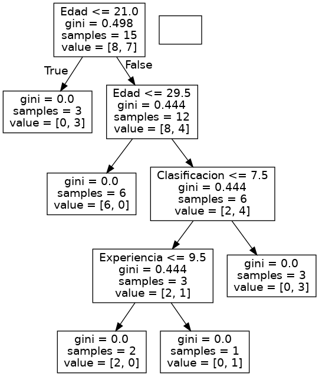

# my-chat-bot

Bot created using [Bot Framework](https://docs.microsoft.com/en-us/azure/bot-service/bot-service-quickstart-create-bot?view=azure-bot-service-4.0&tabs=javascript%2Cvs)

## Directory structure

### src

#### lib

  - IPify
    - Class with the method getIp to consult the ip with api

#### index

- notifyIp
    - Webhook that sends a message with the ip of the bot using IPify class

- bot
    - addConversationReference method that stores a conversation to later send a proactive message when consumming the notifyIp endpoint

## Pattern

#### mvc

  - view: the bot emulator
  - controller: the index
  - model: IPify class

## DecisionTree

### Directory structure

  - tree
      - data.csv: data to analyze
      - tree.py: code in python
      - tree.png: decision tree

  
